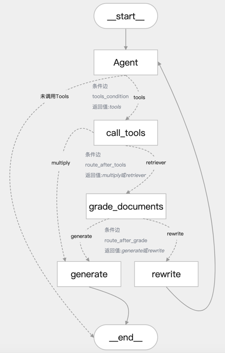

# 1、项目介绍
## 1.1、本次分享介绍    
**(第一期)[2025.2.27]带有记忆功能的流量包推荐智能客服web端用例**                 
主要内容:使用LangGraph+DeepSeek-R1+FastAPI+Gradio实现一个带有记忆功能的流量包推荐智能客服web端用例,同时也支持gpt大模型、国产大模型(OneApi方式)、Ollama本地开源大模型、阿里通义千问大模型                 https://www.bilibili.com/video/BV1m89NYKE2J/                 
https://youtu.be/meuLnVCzEM4                 
**(第二期)[2025.3.2]带有记忆功能的流量包推荐智能客服web端用例+短期记忆和长期记忆+对话历史管理**                   
在第一期应用案例的基础上进行迭代短期记忆、长期记忆和对话历史管理                    
短期记忆(short-term):大模型在本次会话中的上下文记忆，Graph线程内的持久化                                
长期记忆(long-term):长期存储对话历史记录，Graph跨线程持久化               
使用持久性来跟踪对话历史记录，它使继续对话变得容易。但是，随着对话时间越来越长，此对话历史记录可能会累积并占据越来越多的上下文窗口                 
这通常是不可取的，因为它会导致对LLM调用更昂贵、更长，并且可能导致错误。为了防止这种情况发生，也需要管理对话历史记录(自定义函数修剪和过滤state中的消息)                 
https://www.bilibili.com/video/BV1a19bYVEg4/                       
https://youtu.be/CNmrvtCqveI                   
**(第三期)[2025.3.6]带有记忆功能的流量包推荐智能客服web端用例+短期记忆和长期记忆+对话历史管理+PostgreSQL持久化**                   
在第二期应用案例的基础上进行迭代将基于内存的存储调整为PostgreSQL持久化存储                                          
短期记忆(short-term):大模型在本次会话中的上下文记忆，Graph线程内的持久化                                     
长期记忆(long-term):长期存储对话历史记录，Graph跨线程持久化              
https://www.bilibili.com/video/BV1cn9mYVENc/                 
https://youtu.be/4Ok5Ad22yHw               
**(第四期)[2025.3.16]基于LangChain、LangGraph框架和PostgreSQL数据库，结合工具调用和动态路由实现用户意图识别和分诊工作流用例**                
**总体流程如下所示:**             
https://www.bilibili.com/video/BV1AjQvY6Ejv/                    
https://youtu.be/63wwAy99j54                     
用户输入问题，进入agent分诊节点进行用户意图分析                  
若需调用工具，则调用call_tools节点进行工具并行执行；否则直接回复用户问题结束                       
工具调用后，根据工具类型进行路由：                
检索类工具：进入grade_documents进行相关性评分，若相关则路由到generate节点，否则rewrite（最多3次）                               
非检索类工具：直接路由到generate节点                      
生成最终回复并输出                 
流程如下图所示:                      
                   
**（1）核心功能：基于状态图的对话流程**         
定义了一个包含多个节点（Node）和边（Edge）的对话工作流，节点包括：                         
agent：分析用户问题并决定是否调用工具                    
call_tools：并行执行工具调用                   
grade_documents：评估检索到的文档与问题的相关性               
rewrite：重写用户查询以改进问题                   
generate：生成最终回复                
动态路由：                
route_after_tools：根据工具调用结果决定下一步是生成回复还是评分文档              
route_after_grade：根据文档相关性评分决定生成回复还是重写查询                       
**（2）工具调用与并行处理**                
工具配置：通过ToolConfig类管理工具列表和路由配置，支持动态路由（检索类工具路由到grade_documents，其他路由到generate）               
并行工具节点：ParallelToolNode使用线程池（ThreadPoolExecutor）并行执行多个工具调用，提高效率，支持最大工作线程数配置（默认5）          
**（3）数据库与持久化存储**                
连接池管理：使用ConnectionPool管理PostgreSQL数据库连接，支持自动提交、超时设置和连接池状态监控（monitor_connection_pool）                 
线程内持久化：通过PostgresSaver保存对话状态检查点                 
跨线程持久化：通过PostgresStore存储用户记忆（store_memory），支持记忆搜索和存储（如用户输入包含“记住”时保存）                  
重试机制：数据库操作使用tenacity库实现重试（最多3次，指数退避等待），提高健壮性                    
**（4）自然语言处理与提示模板**               
语言模型：通过get_llm获取聊天模型（llm_chat）和嵌入模型（llm_embedding），用于处理用户输入和生成回复              
提示模板：使用create_chain函数加载并缓存提示模板文件（如代理、重写、评分、生成模板），支持结构化输出（如DocumentRelevanceScore）          
消息过滤：filter_messages过滤消息，仅保留AIMessage和HumanMessage，限制最多保留5条历史消息                
**（5）日志与错误处理**           
日志记录：使用logging模块和ConcurrentRotatingFileHandler记录详细日志（DEBUG级别），支持文件轮转（5MB，3个备份）             
错误处理：多层次异常捕获（如数据库连接、工具调用、状态访问等），记录错误并提供默认路由或提示用户                
**（6）用户交互与响应输出**                  
主循环：main函数实现交互式对话，用户输入后通过graph_response处理并输出响应，支持退出命令（quit、exit、q）                 
响应区分：区分工具输出（显示工具名称）和大模型输出（普通回复），提升用户体验                    
**（7）辅助功能**                
可视化：通过save_graph_visualization将状态图保存为PNG文件，便于调试             
配置管理：通过Config类统一管理日志文件路径、数据库URI、提示模板路径等配置                           
**(第五期)[2025.3.19]基于FastAPI、Gradio、LangChain、LangGraph框架实现工具调用和动态路由的分诊工作流用例并对外提供API服务**                      
主要内容:在第四期视频的应用案例4的基础上，使用FastAPI封装API接口对外提供web服务，并使用Gradio实现一个web端页面支持新建会话、历史会话加载、用户注册和登录等                        
https://youtu.be/xZQsGN46dUo         
https://www.bilibili.com/video/BV1fzXPY7Es7/          

## 1.2 LangGraph介绍 
LangGraph 是由 LangChain 团队开发的一个开源框架，旨在帮助开发者构建基于大型语言模型（LLM）的复杂、有状态、多主体的应用           
它通过将工作流表示为图结构（graph），提供了更高的灵活性和控制能力，特别适合需要循环逻辑、状态管理以及多主体协作的场景            
比如智能代理（agent）和多代理工作流            
官方文档:https://langchain-ai.github.io/langgraph/                     

## 1.1 核心概念 
**图结构（Graph Structure）**              
LangGraph 将应用逻辑组织成一个有向图，其中：                    
节点（Nodes）:代表具体的操作或计算步骤，可以是调用语言模型、执行函数或与外部工具交互等                
边（Edges）:定义节点之间的连接和执行顺序，支持普通边（直接连接）和条件边（基于条件动态选择下一步）               
**状态管理（State Management）**              
LangGraph 的核心特点是自动维护和管理状态     
状态是一个贯穿整个图的共享数据结构，记录了应用运行过程中的上下文信息         
每个节点可以根据当前状态执行任务并更新状态，确保系统在多步骤或多主体交互中保持一致性               
**循环能力（Cyclical Workflows）**               
与传统的线性工作流（如 LangChain 的 LCEL）不同，LangGraph 支持循环逻辑          
这使得它非常适合需要反复推理、决策或与用户交互的代理应用         
例如，一个代理可以在循环中不断调用语言模型，直到达成目标                

## 1.2 主要特点
**灵活性:** 开发者可以精细控制工作流的逻辑和状态更新，适应复杂的业务需求            
**持久性:** 内置支持状态的保存和恢复，便于错误恢复和长时间运行的任务             
**多主体协作:** 允许多个代理协同工作，每个代理负责特定任务，通过图结构协调交互             
**工具集成:** 可以轻松集成外部工具（如搜索API）或自定义函数，增强代理能力           
**人性化交互:** 支持“人在回路”（human-in-the-loop）功能，让人类在关键步骤参与决策            
 
## 1.3 使用场景
LangGraph 特别适用于以下场景：             
**对话代理:** 构建能够记住上下文、动态调整策略的智能聊天机器人             
**多步骤任务:** 处理需要分解为多个阶段的复杂问题，如研究、写作或数据分析                
**多代理系统:** 协调多个代理分工合作，比如一个负责搜索信息、另一个负责总结内容的系统           

## 1.4 与 LangChain 的关系
LangGraph 是 LangChain 生态的一部分，但它是独立于 LangChain 的一个模块             
LangChain 更擅长处理简单的线性任务链（DAG），而 LangGraph 专注于更复杂的循环和多主体场景           
你可以单独使用 LangGraph，也可以结合 LangChain 的组件（如提示模板、工具接口）来增强功能                  

# 2、前期准备工作
## 2.1 集成开发环境搭建  
anaconda提供python虚拟环境,pycharm提供集成开发环境                                              
**具体参考如下视频:**                        
【大模型应用开发-入门系列】03 集成开发环境搭建-开发前准备工作                         
https://youtu.be/KyfGduq5d7w                     
https://www.bilibili.com/video/BV1nvdpYCE33/                      

## 2.2 大模型LLM服务接口调用方案
(1)gpt大模型等国外大模型使用方案                  
国内无法直接访问，可以使用代理的方式，具体代理方案自己选择                        
这里推荐大家使用:https://nangeai.top/register?aff=Vxlp                        
(2)非gpt大模型方案 OneAPI方式或大模型厂商原生接口                                              
(3)本地开源大模型方案(Ollama方式)                                              
**具体参考如下视频:**                                           
【大模型应用开发-入门系列】04 大模型LLM服务接口调用方案                    
https://youtu.be/mTrgVllUl7Y               
https://www.bilibili.com/video/BV1BvduYKE75/                                                    
                

# 3、项目初始化
## 3.1 下载源码 
GitHub或Gitee中下载工程文件到本地，下载地址如下：                
https://github.com/NanGePlus/LangGraphChatBot                               
https://gitee.com/NanGePlus/LangGraphChatBot                                   

## 3.2 构建项目
使用pycharm构建一个项目，为项目配置虚拟python环境             
项目名称：LangGraphChatBot                                
虚拟环境名称保持与项目名称一致                

## 3.3 将相关代码拷贝到项目工程中           
直接将下载的文件夹中的文件拷贝到新建的项目目录中                      

## 3.4 安装项目依赖          
命令行终端中直接运行如下命令安装依赖                  
pip install langgraph==0.2.74                  
pip install langchain-openai==0.3.6            
pip install fastapi==0.115.8                         
pip install uvicorn==0.34.0                          
pip install gradio==5.18.0           

# 4、项目测试
## 4.1 带有记忆功能的流量包推荐智能客服web端用例1   
主要内容:使用LangGraph+DeepSeek-R1+FastAPI+Gradio实现一个带有记忆功能的流量包推荐智能客服web端用例,同时也支持gpt大模型、国产大模型(OneApi方式)、Ollama本地开源大模型、阿里通义千问大模型                                                                   
### （1）启动main脚本
进入01_ChatBot文件夹下，在使用python main.py命令启动脚本前，需根据自己的实际情况调整代码中的如下参数                                   
llms.py中关于大模型配置参数的调整，以及main.py脚本中的服务IP和PORT、LangSmith平台的API KEY等的设置                        
### （2）运行webUI脚本进行测试             
进入01_ChatBot文件夹下，再使用python webUI.py命令启动脚本前，需根据自己的实际情况调整代码中的如下参数，运行成功后，可以查看smith的跟踪情况                  
是否要流式输出可设置stream_flag = False或True，检查URL地址中的IP和PORT是否和main脚本中相同           
运行成功后直接打开网址，在浏览器端进行交互测试              

## 4.2 应用案例2:带有记忆功能的流量包推荐智能客服web端用例+短期记忆和长期记忆+对话历史管理 
在应用案例1的基础上进行迭代短期记忆、长期记忆和对话历史管理                  
短期记忆(short-term):大模型在本次会话中的上下文记忆，Graph线程内的持久化                              
长期记忆(long-term):长期存储对话历史记录，Graph跨线程持久化              
使用持久性来跟踪对话历史记录，它使继续对话变得容易。但是，随着对话时间越来越长，此对话历史记录可能会累积并占据越来越多的上下文窗口                
这通常是不可取的，因为它会导致对LLM调用更昂贵、更长，并且可能导致错误。为了防止这种情况发生，也需要管理对话历史记录(自定义函数修剪和过滤state中的消息)            
### （1）短期记忆、长期记忆、对话历史管理测试
进入02_ChatBot文件夹下，在使用python demoWithMemory.py命令启动脚本前，需根据自己的实际情况调整代码中的如下参数                                   
llms.py中关于大模型配置参数的调整            
### （2）启动main脚本
进入02_ChatBot文件夹下，在使用python main.py命令启动脚本前，需根据自己的实际情况调整代码中的如下参数                                   
llms.py中关于大模型配置参数的调整，以及main.py脚本中的服务IP和PORT、LangSmith平台的API KEY等的设置                        
### （3）运行webUI脚本进行测试             
进入02_ChatBot文件夹下，再使用python webUI.py命令启动脚本前，需根据自己的实际情况调整代码中的如下参数，运行成功后，可以查看smith的跟踪情况                  
是否要流式输出可设置stream_flag = False或True，检查URL地址中的IP和PORT是否和main脚本中相同           
运行成功后直接打开网址，在浏览器端进行交互测试            

## 4.3 应用案例3:带有记忆功能的流量包推荐智能客服web端用例+PostgreSQL持久化记忆存储                
### （1）使用Docker的方式运行PostgreSQL数据库                   
进入官网 https://www.docker.com/ 下载安装Docker Desktop软件并安装，安装完成后打开软件                
打开命令行终端，cd 04_ChatBotWithPostgres文件夹下，PostgreSQL的docker配置文件为docker-compose.yml             
运行 docker-compose up -d 命令后台启动PostgreSQL数据库服务。运行成功后可在Docker Desktop软件中进行管理操作或使用命令行操作或使用指令        
若要删除容器在命令行终端中运行 docker-compose down --volumes                      
因为LangGraph的PostgresStore需要使用到pgvector，因此需要在容器中按照如下步骤进行操作，直接使用Docker Desktop软件中进行操作                         
安装依赖           
apt update               
apt install -y git build-essential postgresql-server-dev-15                 
编译并安装 pgvector          
git clone --branch v0.7.0 https://github.com/pgvector/pgvector.git                
cd pgvector               
make                 
make install                
验证安装，检查扩展文件是否安装成功                    
ls -l /usr/share/postgresql/15/extension/vector*                     
接下来，若要在脚本中进行使用，首先在系统环境中需要安装PostgreSQL 的开发库（libpq），因为 psycopg 需要它来编译或运行,根据自己的操作系统选择进行安装                                 
MacOS (使用 Homebrew): brew install postgresql                 
最后，再安装相关依赖包              
pip install langgraph-checkpoint-postgres                    
pip install psycopg psycopg-pool        
同时，使用数据库客户端软件远程登陆进行可视化操作，这里使用Navicat客户端软件             
### （2）短期记忆、长期记忆、对话历史管理测试
进入03_ChatBotWithPostgres文件夹下，在使用python demoWithMemory.py命令启动脚本前，需根据自己的实际情况调整代码中的llms.py中关于大模型配置参数的调整              
### （3）启动main脚本
进入03_ChatBotWithPostgres文件夹下，在使用python main.py命令启动脚本前，需根据自己的实际情况调整代码中的如下参数                                   
llms.py中关于大模型配置参数的调整，以及main.py脚本中的服务IP和PORT、LangSmith平台的API KEY等的设置                        
### （4）运行webUI脚本进行测试             
进入03_ChatBotWithPostgres文件夹下，再使用python webUI.py命令启动脚本前，需根据自己的实际情况调整代码中的如下参数，运行成功后，可以查看smith的跟踪情况                  
是否要流式输出可设置stream_flag = False或True，检查URL地址中的IP和PORT是否和main脚本中相同           
运行成功后直接打开网址，在浏览器端进行交互测试            

## 4.4 应用案例4:基于LangChain、LangGraph框架和PostgreSQL数据库，结合工具调用和动态路由实现用户意图识别和分诊工作流用例            
在运行脚本前，打开命令行终端按照如下命令进行相关依赖安装：                            
pip install langchain-community==0.3.19                        
pip install langchain-chroma==0.2.2                        
pip install pdfminer                     
pip install pdfminer.six                         
pip install nltk==3.9.1                      
pip install psycopg2==2.9.10              
pip install concurrent-log-handler==0.9.25                           
### （1）使用Docker的方式运行PostgreSQL数据库  
请先按照案例3中的操作流程启动相关服务                
### （2）知识灌库 
进入04_RagAgent文件夹下，运行vectorSaveTest.py脚本，文档加载->文档切分->向量化->灌入向量数据库            
可以参考如下项目:                    
https://github.com/NanGePlus/RagLangChainTest            
### （3）demo测试
进入04_RagAgent文件夹下，在使用python demoRagAgent.py命令启动脚本前，需根据自己的实际情况调整代码中的llms.py中关于大模型配置参数的调整                
**注意事项:**             
在测试使用调用oneapi(阿里通义千问)、qwen的接口时，会报错如下所示：                
openai.BadRequestError: Error code: 400 - {'error': {'message': 'input should not be none.: payload.input.contents (request id: 2024082015351785023974771558878)', 'type': 'upstream_error', 'param': '400', 'code': 'bad_response_status_code'}}              
经过分析后，langchain_openai/embeddings包中的base.py源码中默认如下代码的true改为false                
check_embedding_ctx_length: bool = False                   
源码完整路径如下所示:                  
/opt/anaconda3/envs/RagLangchainTest/lib/python3.11/site-packages/langchain_openai/embeddings/base.py          
修改后重新启动main服务，进行重新测试              
### （4）启动main脚本
进入04_RagAgent文件夹下，在使用python main.py命令启动脚本前，需根据自己的实际情况调整代码中的如下参数                                   
llms.py中关于大模型配置参数的调整，以及main.py脚本中的服务IP和PORT、LangSmith平台的API KEY等的设置                        
### （5）运行webUI脚本进行测试             
进入04_RagAgent文件夹下，再使用python webUI.py命令启动脚本前，需根据自己的实际情况调整代码中的如下参数，运行成功后，可以查看smith的跟踪情况                     
是否要流式输出可设置stream_flag = False或True，检查URL地址中的IP和PORT是否和main脚本中相同            
运行成功后直接打开网址，在浏览器端进行交互测试              
            

 
          

    
